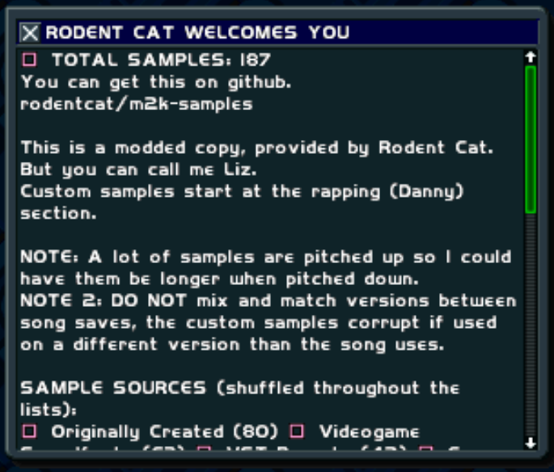

(I'll just keep updating the screenshot as I add more samples...)

Requires WADtool: https://github.com/juju2143/wadtool

Helpful reading from INFU: https://infu.fyi/music-software-ps1-nerdy#modding

--------------------------------

Put your WAD and IND into the root of this git, then run release_patcher.bat. It should be in the same folder as that .bat.

Type in the name of the WAD/IND you want to modify, but don't type an extension. So like, ANDY or steve_ed.

Drag and drop wadtool.exe (wherever you stored that) into the command prompt that just popped up, then hit "enter"

Boom, ya got it. Now you can reimplement the WAD/IND into the software. NOTE: The text file doesn't work with the PC version yet, it errors out, but that's fine, don't worry about it. 